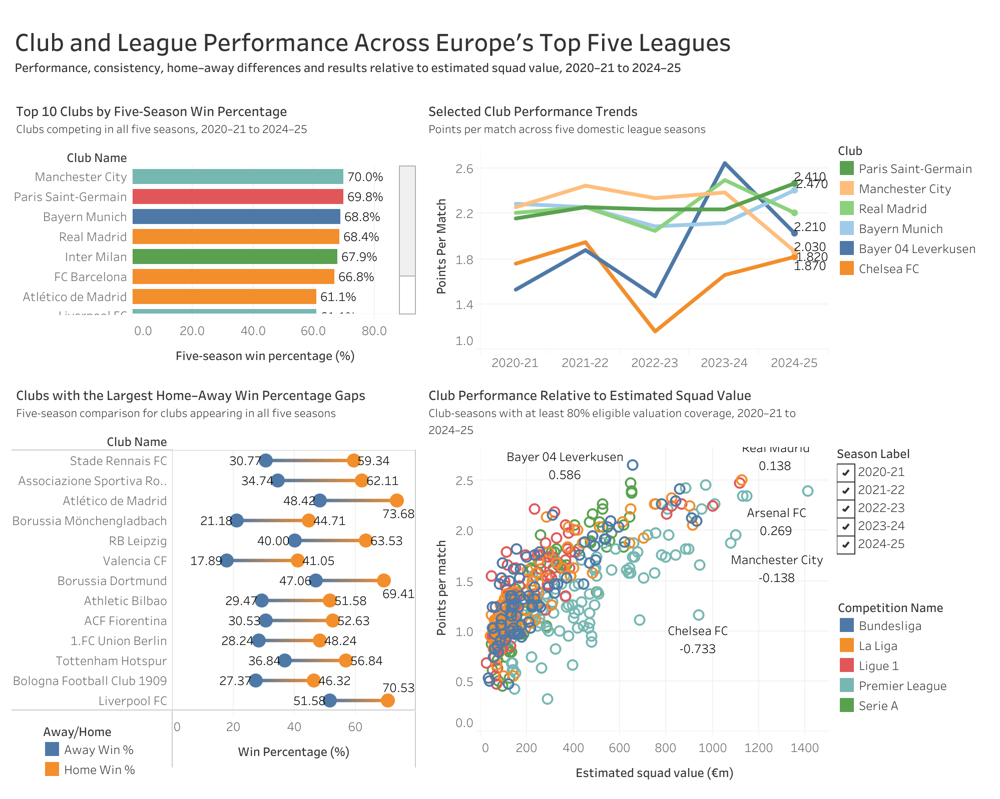
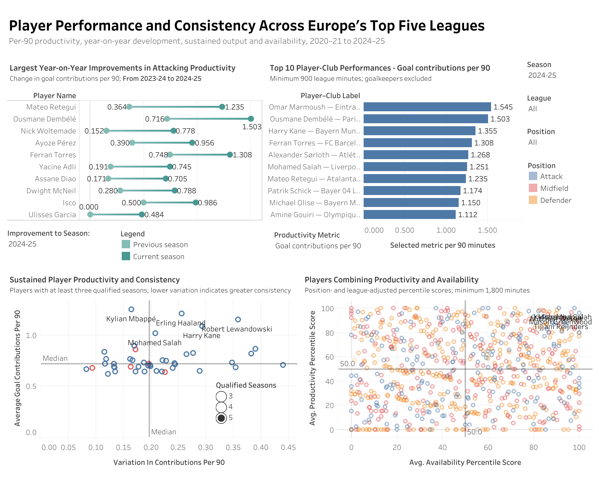
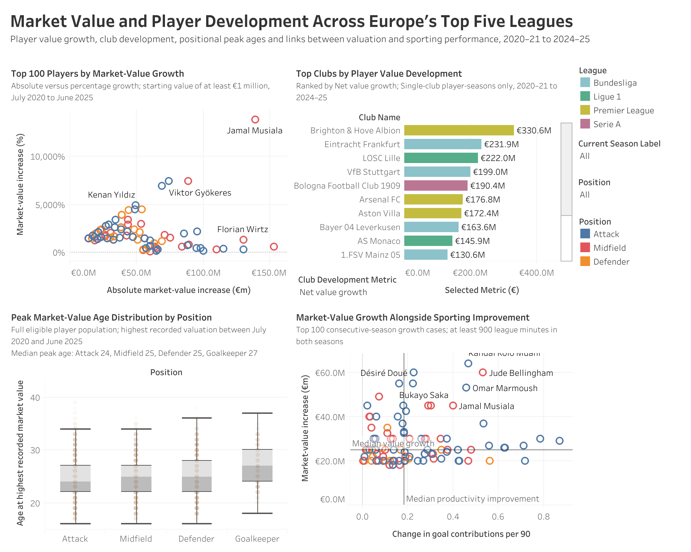
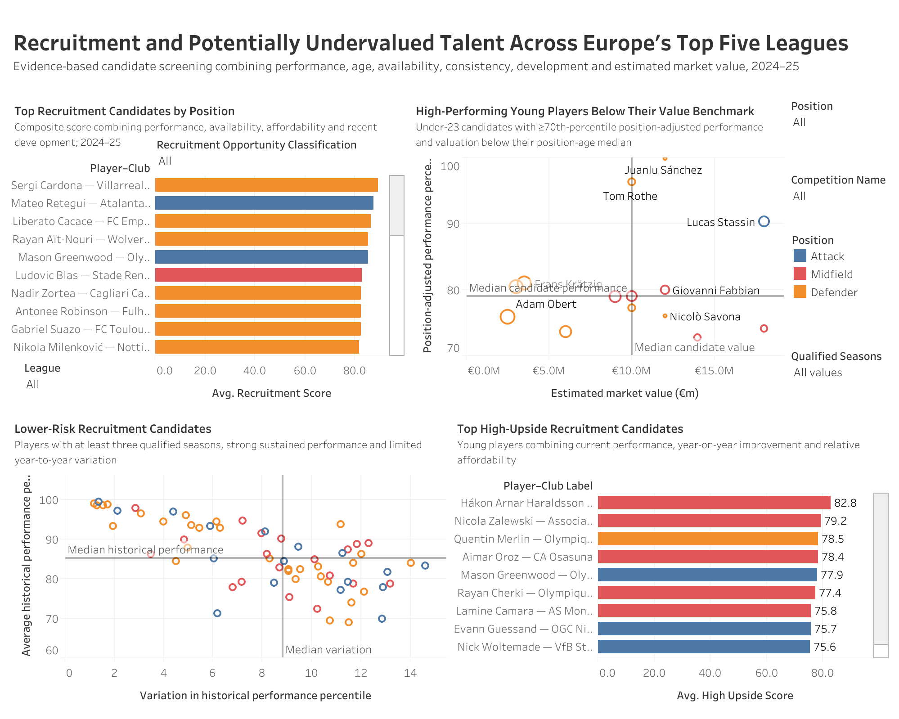
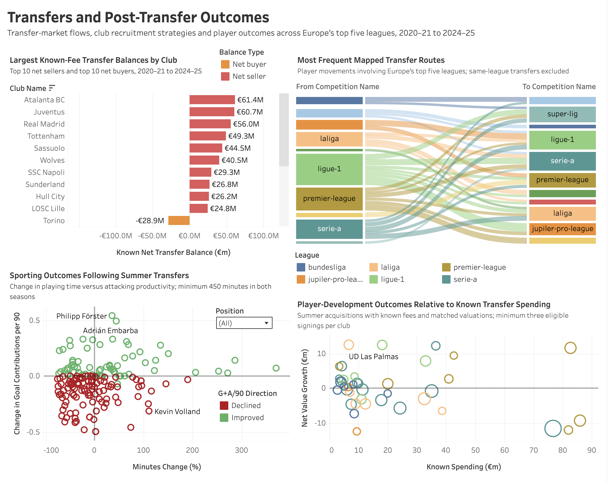

# European Football Talent and Transfer Analytics

> A PostgreSQL-first analytics project examining club performance, player productivity, market-value development, recruitment opportunities and transfer outcomes across Europe’s five major domestic leagues from 2020–21 to 2024–25.

## Project Overview

This project builds a relational football analytics workflow from multiple Transfermarkt-derived CSV files and uses PostgreSQL as the primary analytical tool.

The analysis focuses on five connected questions:

1. **Club and League Performance** — which clubs performed best, most consistently and most efficiently?
2. **Player Performance and Consistency** — which players combined productivity, improvement and reliable playing time?
3. **Market Value and Player Development** — which players and clubs generated the strongest estimated market-value growth?
4. **Recruitment and Potentially Undervalued Talent** — which players present interesting recruitment profiles after adjusting for position, age, playing time and estimated value?
5. **Transfers and Post-Transfer Outcomes** — how did transfer flows, known-fee balances and player outcomes develop after club moves?

The project follows an end-to-end workflow:

```text
Raw Transfermarkt-derived CSV data
        ↓
PostgreSQL raw schema
        ↓
Data-quality checks and cleaning
        ↓
Reusable analytical views and indexes
        ↓
Theme-specific SQL analysis
        ↓
Dashboard-ready CSV exports
        ↓
Tableau visualisations
        ↓
GitHub findings and documentation
```

## Business Objective

The project demonstrates how relational football data can support club-strategy and recruitment analysis.

Rather than building a single player ranking, the analysis separates club performance, player output, valuation development, recruitment screening and transfer outcomes. This allows each question to use methodology appropriate to its analytical grain.

The final recruitment component is designed as a **screening and decision-support tool**, not a replacement for professional scouting.

## Scope

### Competitions

- Premier League
- La Liga
- Bundesliga
- Serie A
- Ligue 1

### Seasons

- 2020–21
- 2021–22
- 2022–23
- 2023–24
- 2024–25

### Included data

- domestic league matches
- club match results
- player appearances and minutes
- goals and assists
- player demographics and positions
- historical estimated market values
- transfer movements and recorded fees
- club and competition information

### Excluded from the core analysis

- domestic cup competitions
- league cups and super cups
- UEFA club competitions
- national-team matches and tournaments
- incomplete 2025–26 competition data

## Technology Stack

| Tool | Role |
|---|---|
| **PostgreSQL** | Database engine and primary analytical environment |
| **DBeaver Community Edition** | SQL development and database interface |
| **Tableau Public** | Interactive visualisation and dashboard layer |
| **Git / GitHub** | Version control and portfolio presentation |
| **Markdown** | Methodology and findings documentation |

## Dataset

The source data comes from David Cariboo’s **Football Data from Transfermarkt** dataset on Kaggle:

**Dataset:** https://www.kaggle.com/datasets/davidcariboo/player-scores

The upstream dataset is actively maintained. This repository documents the snapshot and tables actually used in this project rather than assuming the current online schema is identical.

The raw source archive is **not redistributed in this repository** because it exceeds 200 MB and is available from the original source.

## Database Design

The project uses two logical database layers:

- `football_raw` — source-aligned imported tables
- `football` — cleaned, scoped and analytical views

Eight source tables are used:

- `competitions`
- `clubs`
- `players`
- `games`
- `club_games`
- `appearances`
- `player_valuations`
- `transfers`

Important relationships include:

```text
competitions ──< games
competitions ──< clubs

games ──< club_games
games ──< appearances

players ──< appearances
players ──< player_valuations
players ──< transfers

clubs ──< appearances / valuations / transfers
```

## Data Quality and Cleaning

The project performs explicit checks for:

- duplicate records
- missing values
- invalid IDs
- inconsistent or invalid dates
- appearance-minute anomalies
- transfer-fee quality
- historical club-player relationships
- valuation coverage
- competition and season scope

Cleaning is implemented through SQL views so the raw imported tables remain unchanged.

Important treatment rules include:

- blank strings are standardised to `NULL`;
- invalid negative sentinel IDs are converted to `NULL`;
- invalid player heights and appearance minutes are flagged and excluded from analytical use;
- transfer fees distinguish **positive known fees**, **recorded zero fees**, and **missing/undisclosed fees**;
- historical player analysis uses club-season membership rather than a player’s current club where possible.


---

# Analytical Themes

## Theme 1 — Club and League Performance

**Objective:** Evaluate club performance, consistency, home–away strength, scoring output and performance relative to estimated player market value.

Theme 1 covers **8,982 domestic league matches** and **486 club-season records**. Five-season comparisons use the 63 clubs appearing in all five seasons.

### Selected findings

- **Manchester City** recorded the strongest overall five-season win percentage at **70.00%**.
- **Bayer Leverkusen** produced the strongest single league-season win percentage, at **82.35% in 2023–24**.
- **Bayern Munich** recorded the highest five-season scoring rate at **2.829 goals per match**.
- **Real Madrid** had the strongest defensive rate at **0.837 goals conceded per match**.
- The **Bundesliga** was the highest-scoring league overall at **3.135 goals per match**.
- In value-adjusted analysis, **RC Lens** recorded the strongest average performance residual among clubs with at least three eligible seasons.

### Methodological highlight

Market-value efficiency is measured as:

```text
Performance residual = Actual points per match − Expected points per match
```

Expected performance is estimated within each league-season from the natural logarithm of participating-player market value. Club-seasons require at least 80% valuation coverage and valuations no more than 180 days old.



<a href="https://public.tableau.com/views/EuropeanFootballTalentandTransferAnalyticsTheme1/Dashboard1?:language=en-US&:sid=&:redirect=auth&:display_count=n&:origin=viz_share_link" target="_blank"></a>

[Read the full Theme 1 findings](documentation/theme_1_club_league_findings.md)

---

## Theme 2 — Player Performance and Consistency

**Objective:** Identify productive, reliable and improving players while making fair comparisons across positions, seasons and playing time.

### Core rules

- standard per-90 threshold: **900 league minutes**
- availability analysis: **1,800 league minutes**
- sustained-performance analysis: at least **3 qualified seasons**
- U23 definition: **age 22 or younger at season end**
- goalkeepers excluded from attacking-productivity rankings

### Selected findings

- **Omar Marmoush** led qualified 2024–25 player-club records for goal contributions per 90 at **1.545**.
- **Ousmane Dembélé** followed at **1.503**.
- **Mateo Retegui** recorded the largest year-on-year increase into 2024–25, improving by **+0.871 goal contributions per 90**.
- Sustained-performance analysis highlighted players including **Kylian Mbappé, Erling Haaland, Robert Lewandowski, Harry Kane and Mohamed Salah**.
- The productivity-and-availability analysis uses position-, league- and season-adjusted percentile scores rather than raw cross-position comparisons.

### Per-90 calculation

```text
Goal contributions per 90 =
(Goals + Assists) × 90 ÷ Minutes played
```



<a href="https://public.tableau.com/views/EuropeanFootballTalentandTransferAnalyticsTheme2/Dashboard1?:language=en-US&:sid=&:redirect=auth&:display_count=n&:origin=viz_share_link" target="_blank"></a>

[Read the full Theme 2 findings](documentation/theme_2_player_performance_findings.md)

---

## Theme 3 — Market Value and Player Development

**Objective:** Understand how estimated player market values developed, how growth differed by age and position, and which clubs generated strong development outcomes.

### Core rules

- valuation window: **1 July 2020 to 30 June 2025**
- standard performance threshold: **900 league minutes**
- U23 definition: **age 22 or younger at season end**
- percentage-growth ranking requires starting value of at least **€1 million**
- ambiguous multi-club player-seasons are excluded from club development attribution
- medians are used for position-level value comparison

### Selected findings

- **Jude Bellingham** recorded the largest absolute project-window increase: **€27m → €180m (+€153m)**.
- **Jamal Musiala** recorded the strongest eligible percentage increase: **€1m → €140m**.
- **Brighton & Hove Albion** generated the strongest club-level net value growth at approximately **€330.6m**.
- Brighton also developed the largest number of distinct high-growth players, with **14**.
- Attackers reached their highest observed values at a median age of **24**, compared with **27 for goalkeepers**.

Absolute and percentage growth are reported separately because low starting values can dominate percentage rankings.



<a href="https://public.tableau.com/views/EuropeanFootballTalentandTransferAnalyticsTheme3/Dashboard1?:language=en-US&:sid=&:redirect=auth&:display_count=n&:origin=viz_share_link" target="_blank"></a>

[Read the full Theme 3 findings](documentation/theme_3_market_value_findings.md)

---

## Theme 4 — Recruitment and Potentially Undervalued Talent

**Objective:** Build an evidence-based recruitment shortlist using age, position-adjusted output, availability, recent development and estimated market value.

Theme 4 is the main **decision-support** component of the project.

### Recruitment score

```text
50%  Current position-adjusted performance
20%  Availability
15%  Affordability
15%  Recent development
```

The weights are deliberately transparent rather than presented as an optimised black-box model.

### Default maximum estimated values

| Position | Maximum value |
|---|---:|
| Goalkeeper | €30m |
| Defender | €40m |
| Midfield | €50m |
| Attack | €60m |

### Final shortlist

The 2024–25 shortlist contains **211 candidates** across six classifications:

| Classification | Candidates |
|---|---:|
| Recruitment watchlist | 75 |
| Potential value opportunity | 55 |
| Established value | 25 |
| Consistent performer | 24 |
| High-upside candidate | 20 |
| Emerging talent | 12 |

Selected value-opportunity cases include **Juanlu Sánchez**, **Lucas Stassin**, **Giovanni Fabbian**, **Farès Chaïbi** and **Arnau Martínez**.

The shortlist identifies statistically interesting profiles; it does not account for tactical fit, wages, contract details, injury history, personality or qualitative scouting.



<a href="https://public.tableau.com/views/EuropeanFootballTalentandTransferAnalyticsTheme4/Dashboard1?:language=en-US&:sid=&:redirect=auth&:display_count=n&:origin=viz_share_link" target="_blank"></a>

[Read the full Theme 4 findings](documentation/theme_4_recruitment_findings.md)

---

## Theme 5 — Transfers and Post-Transfer Outcomes

**Objective:** Assess transfer-market flows, club recruitment strategies and player outcomes after changing clubs.

### Fee treatment

Transfer records distinguish:

- **positive known fees**
- **recorded zero-fee transfers**
- **missing or undisclosed fees**

Financial results therefore represent **known-fee measures**, not complete accounting totals.

### Post-transfer comparison rules

- clean cohort restricted to **July–September transfers**
- sporting comparisons require at least **450 league minutes before and after the transfer**
- young-acquisition analysis focuses on players aged **23 or younger**
- development-efficiency analysis requires matched valuations and known acquisition spending

### Selected findings

- **Atalanta** recorded the strongest positive known-fee club balance at **+€61.4m**.
- **Leicester** recorded the largest negative known-fee balance at **−€105.15m**.
- **Serie A** was the only top-five competition with a positive mapped net player flow in the analysed sample.
- **Ligue 1** recorded the largest mapped net player outflow.
- Players aged **21–23** recorded the highest median known transfer fee at **€2.5m**.
- **Midfielders** recorded the highest positional median known fee at **€2.5m**.
- **Perr Schuurs** recorded the largest absolute market-value increase in the clean matched summer-transfer cohort at **+€18m**.
- **UD Las Palmas** ranked first for young-player development efficiency relative to known acquisition spending in the eligible sample.

### Development efficiency

```text
Development efficiency =
Net post-transfer estimated market-value growth
÷ Known acquisition spending
```

This is an analytical indicator, not an audited financial return.



<a href="https://public.tableau.com/views/EuropeanFootballTalentandTransferAnalyticsTheme5/Dashboard1?:language=en-US&:sid=&:redirect=auth&:display_count=n&:origin=viz_share_link" target="_blank"></a>

[Read the full Theme 5 findings](documentation/theme_5_transfers_post_transfer_findings.md)

---

# Tableau Dashboards

Selected analytical outputs are presented through five interactive Tableau Public dashboards. Each dashboard is the communication layer for SQL-generated analytical outputs rather than the primary analytical engine.

<a href="https://public.tableau.com/views/EuropeanFootballTalentandTransferAnalyticsTheme1/Dashboard1?:language=en-US&:sid=&:redirect=auth&:display_count=n&:origin=viz_share_link" target="_blank"></a>
<a href="https://public.tableau.com/views/EuropeanFootballTalentandTransferAnalyticsTheme2/Dashboard1?:language=en-US&:sid=&:redirect=auth&:display_count=n&:origin=viz_share_link" target="_blank"></a>
<a href="https://public.tableau.com/views/EuropeanFootballTalentandTransferAnalyticsTheme3/Dashboard1?:language=en-US&:sid=&:redirect=auth&:display_count=n&:origin=viz_share_link" target="_blank"></a>
<a href="https://public.tableau.com/views/EuropeanFootballTalentandTransferAnalyticsTheme4/Dashboard1?:language=en-US&:sid=&:redirect=auth&:display_count=n&:origin=viz_share_link" target="_blank"></a>
<a href="https://public.tableau.com/views/EuropeanFootballTalentandTransferAnalyticsTheme5/Dashboard1?:language=en-US&:sid=&:redirect=auth&:display_count=n&:origin=viz_share_link" target="_blank"></a>

The `outputs/` directory contains selected dashboard-ready CSV extracts generated from SQL.

See [`outputs/README.md`](outputs/README_outputs.md) for details.

---

## SQL Workflow

The SQL directory follows the order in which the analytical environment is created:

1. database setup
2. table creation
3. data import
4. data-quality checks
5. cleaning and standardisation
6. reusable views and indexes
7. Theme 1–5 analysis
8. Tableau/export queries

This structure allows the analytical logic to be inspected independently from the visualisation layer.

---

# Reproducing the Project

## 1. Obtain the source data

Download the dataset from:

https://www.kaggle.com/datasets/davidcariboo/player-scores

The raw data are intentionally not stored in this repository.

See [`data/README.md`](data/README.md) for the source files used.

## 2. Create the PostgreSQL environment

Run the setup scripts in numerical order from the `sql/` directory.

The exact local CSV import paths in the import script may need to be changed for your machine.

## 3. Run data-quality and cleaning scripts

Execute the data-quality checks before relying on the analytical views.

Cleaning is performed through the project's SQL workflow rather than through manually edited output files.

## 4. Create analytical views and indexes

Run `05_create_views_and_indexes.sql` before the theme-specific analytical scripts.

## 5. Run theme analyses

Execute each theme's analysis SQL and, where needed, its export-query script.

## 6. Refresh Tableau data

Selected CSV outputs can be used to refresh or recreate the Tableau worksheets and dashboards.

---

# Methodological Principles

The analysis follows several principles intended to keep comparisons interpretable:

- use minimum-minute thresholds for player rate statistics;
- compare players within relevant position/league/season groups;
- keep total output separate from per-90 output;
- use historical club-season membership rather than current club where possible;
- distinguish absolute market-value growth from percentage growth;
- use medians where extreme values distort averages;
- separate known transfer fees from zero and missing/undisclosed fees;
- treat estimated market values as estimates, not sale prices;
- describe post-transfer changes as associations rather than causal effects.

Full details are available in [`documentation/methodology.md`](documentation/methodology.md).

---

# Main Limitations

- Transfermarkt market values are estimates rather than realised prices.
- Transfer-fee coverage is incomplete.
- Goals and assists do not capture the full contribution of defenders, midfielders or goalkeepers.
- Goalkeeper-specific performance statistics are limited in the source data.
- Per-90 measures remain sensitive to player role and game state.
- Promoted and relegated clubs have unequal observation periods in some analyses.
- Valuation dates and transfer/performance periods do not always align perfectly.
- Post-transfer changes do not demonstrate causation.
- Injury history, wages, contract terms and tactical fit are outside the dataset.
- Some source transfer records contain unusual or duplicated-looking structures.

---

# Documentation

- [`Methodology`](documentation/methodology.md)
- [`Data Dictionary`](documentation/data_dictionary.md)
- [`Theme 1 Findings`](documentation/theme_1_club_league_findings.md)
- [`Theme 2 Findings`](documentation/theme_2_player_performance_findings.md)
- [`Theme 3 Findings`](documentation/theme_3_market_value_findings.md)
- [`Theme 4 Findings`](documentation/theme_4_recruitment_findings.md)
- [`Theme 5 Findings`](documentation/theme_5_transfers_post_transfer_findings.md)

---

# Data Attribution

Source dataset:

**David Cariboo — Football Data from Transfermarkt**  
https://www.kaggle.com/datasets/davidcariboo/player-scores

Please refer to the source dataset page for the latest dataset information and applicable usage/licensing terms.

---

## Author

**Andy Nguyen**

- GitHub: `[Andy Nguyen](https://github.com/andynguyen1309)`
- LinkedIn: `[Andy Nguyen](https://www.linkedin.com/in/khoa-anh-andy-nguyen-275523252/)`
- Tableau Public dashboards: [Theme 1](https://public.tableau.com/views/EuropeanFootballTalentandTransferAnalyticsTheme1/Dashboard1?:language=en-US&:sid=&:redirect=auth&:display_count=n&:origin=viz_share_link) · [Theme 2](https://public.tableau.com/views/EuropeanFootballTalentandTransferAnalyticsTheme2/Dashboard1?:language=en-US&:sid=&:redirect=auth&:display_count=n&:origin=viz_share_link) · [Theme 3](https://public.tableau.com/views/EuropeanFootballTalentandTransferAnalyticsTheme3/Dashboard1?:language=en-US&:sid=&:redirect=auth&:display_count=n&:origin=viz_share_link) · [Theme 4](https://public.tableau.com/views/EuropeanFootballTalentandTransferAnalyticsTheme4/Dashboard1?:language=en-US&:sid=&:redirect=auth&:display_count=n&:origin=viz_share_link) · [Theme 5](https://public.tableau.com/views/EuropeanFootballTalentandTransferAnalyticsTheme5/Dashboard1?:language=en-US&:sid=&:redirect=auth&:display_count=n&:origin=viz_share_link)

---

## Project Status

**Core project complete:** five analytical themes, SQL workflow, theme-specific findings and Tableau visualisations.

Remaining publication tasks may include the final ER diagram, repository links and final profile/contact details.
